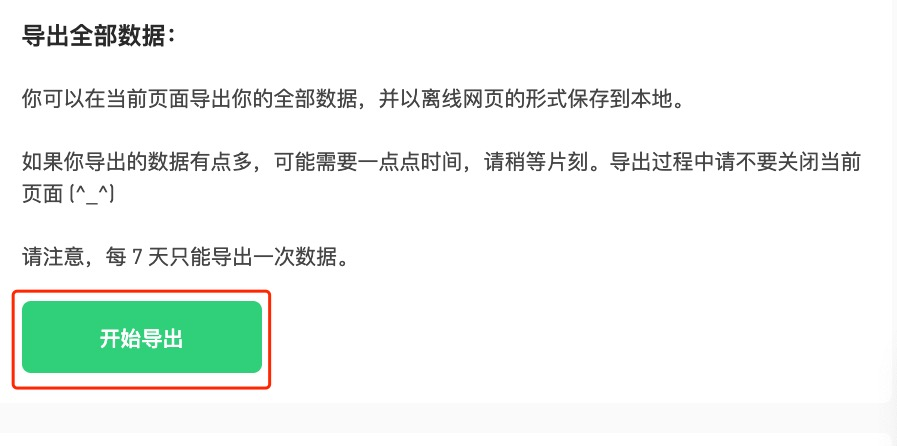
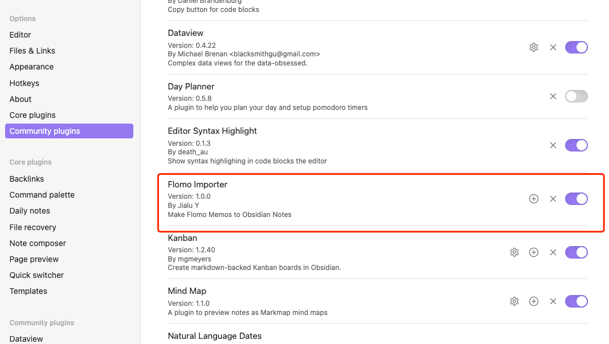
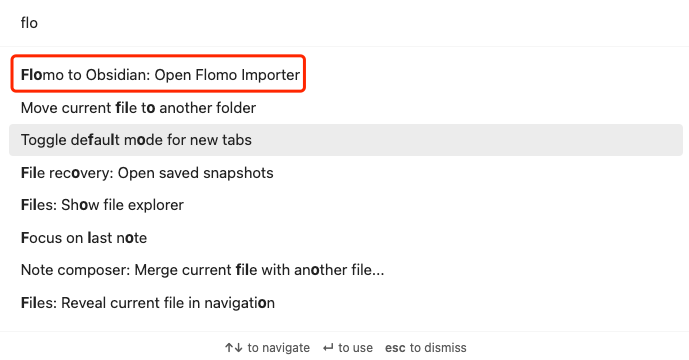
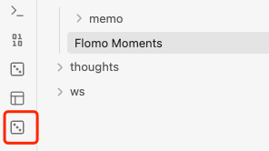
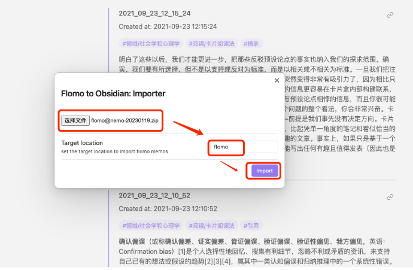
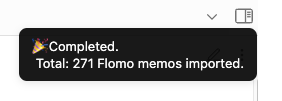
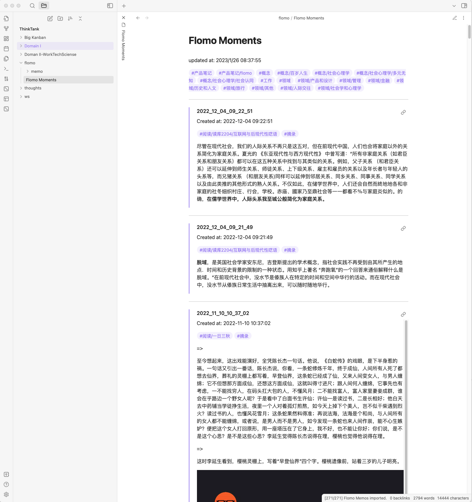

# Flomo Importer

## ☕️ Make Flomo Memos to Obsidian Notes.
##### 💡 (**Note:** This is not an offcial solution by Flomo) 
 

Author: [Jialu Y](https://github.com/jia6y)
 
 
## Features supported
- Import Flomo memos to Obsidian
- Merge Flomo Atttachmets into Obsidian attachment folder
- Update Attachment links within Flomo memos to point to Obsidian attachment location
- Customize target vault location to import
- Generate `Flomo Moments`

 

## First time to use it?

Quick starting guide:

- 📦 Export from Flomo
  1. Go to "Account Details" \
  
  2. Select "Export All (in HTML)" \
  
  3. Click on "Start to export" \
  

- 🎉 Import to Obsidian
  1. Enable **Flomo Importer** plugin \
  
  2. Use command "Open Flomo Importer" \
  
  3. Alternatively, you can use the "Import Button" \
  
  4. Select Flomo Data File, then Import. By default all memos will be imported to "flomo" folder, you can modify the "Target location" to change it \
  
  5. Once Import completed, you'll get a Notice. \
  
  6. Go to **Flmomo Moments** \
  

 

## Support 🧑🏻‍💻
Please feel free to reach out to me if there's any issue or questions. :)

 

## Buy me a coffee

